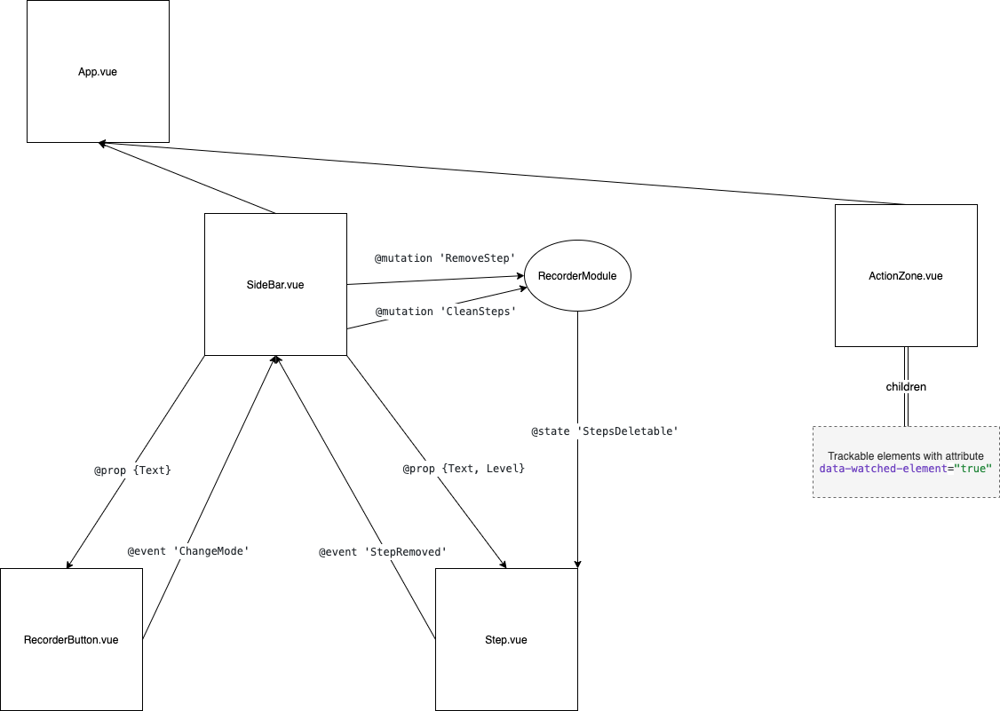

# Vue DOM Recorder

Proof of concept to track clicks in input type elements. Clicks are showed as steps that shows the logical order for the interaction.

- Any element inside __ActionZone.vue__ with attribute data-watched-element="true" will be logged
- You can disable this with data-watched-element="false"

## Project setup

```bash
yarn install
```

### Compiles and hot-reloads for development

```bash
yarn serve
```

### Compiles and minifies for production

```bash
yarn build
```

### Run your unit tests

```bash
yarn test:unit
```

### Run your e2e tests

```bash
yarn test:e2e
```

### Lints and fixes files

```bash
yarn lint
```

### Customize configuration

See [Configuration Reference](https://cli.vuejs.org/config/).

## Folder structure

- __cypress__ # local cypress data for e2e test
- __public__ # static assets
- __src__
  - __assets__ # assets to include inside webpack pipeline
    - __styles__ # global scss / scss styles
  - __components__ # vue components
  - __store__ # vuex integration
- __tests__
  - __e2e__
    - __specs__ # cypress e2e tests
  - __unit__ # jest unit tests

### Notes

- Jest tests should be inside __tests/unit__
  - Name should be *componentName*.spec.ts
- Cypress tests should be inside __tests/e2e/spec__
  - Name should be *businessFeature.spec.ts*

## Basic flow



## Roadmap

- migrating from global event listener (outside click) approach to directive based
- better responsiveness for SideBar.vue
- inject RecorderModule into vue components
- cypress aliases